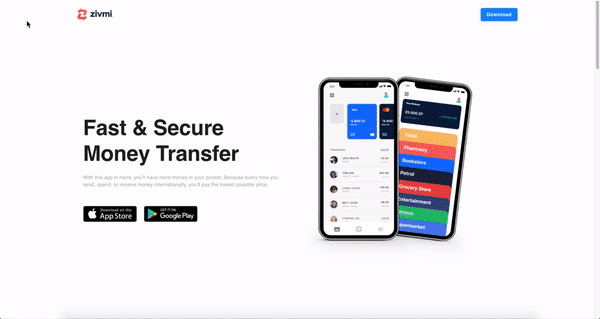

# Zivmi

Landing Page




## Requirements

1. NodeJS: https://nodejs.org/en/
1. Yarn: https://yarnpkg.com/

## Development

1. Install dependencies

```
yarn
```

2. Run Application

```
yarn start
```

3. Run the app

```
http://localhost:3000
````